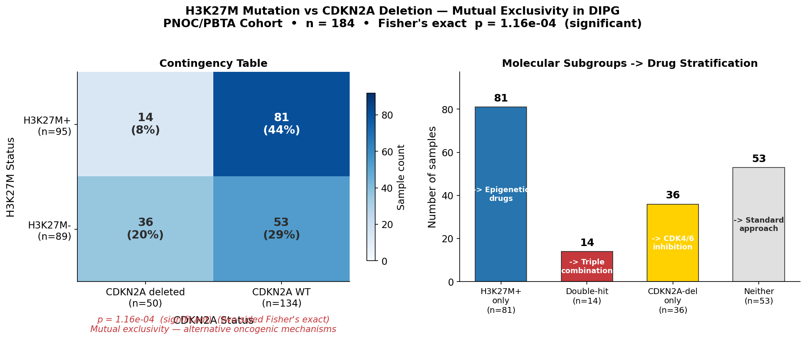
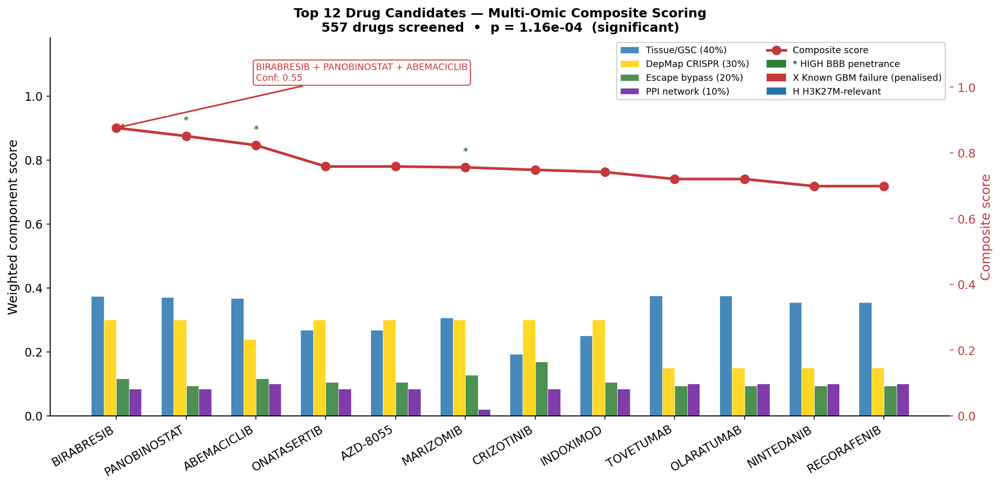
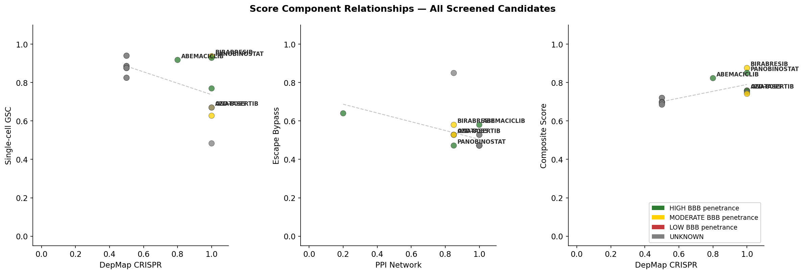
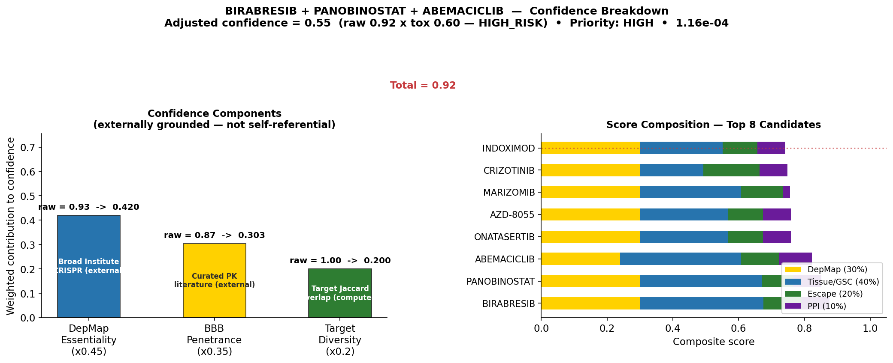

# GBM/DIPG Drug Repurposing Pipeline

**A multi-omic computational pipeline for prioritising drug combinations in H3K27M-mutant Diffuse Intrinsic Pontine Glioma (DIPG)**

> Developed by Shruthi Sathya | v5.4 | March 2026  
> Preprint: [add bioRxiv DOI once submitted]  
> Contact: [your email]

---

## Overview

DIPG is a universally fatal pediatric brainstem cancer with no curative treatment. The H3K27M histone mutation, present in ~80% of cases, fundamentally rewires the epigenetic landscape and creates therapeutic vulnerabilities not present in adult GBM.

This pipeline integrates five independent data sources to systematically screen 557 CNS/oncology drugs and identify combination hypotheses tailored to the H3K27M molecular context:

1. **Patient genomics** — 184 PNOC/PBTA DIPG samples (CNA + mutation data)
2. **Single-cell RNA-seq** — Filbin 2018 H3K27M scRNA-seq, 609 stem-like GSC cells
3. **CRISPR essentiality** — Broad Institute DepMap, 52 GBM cell lines
4. **RNA reference cohorts** — GSE50021 (35 DIPG) + GSE115397 (5 H3K27M pons)
5. **PPI network** — STRING-DB live API + curated fallback

---

## Key Findings

### Genomic Co-occurrence (n=184 PNOC/PBTA patients)

| Alteration | n | % |
|-----------|---|---|
| H3K27M mutation | 95 | 52% |
| CDKN2A deletion | 50 | 27% |
| Double-hit (both) | 14 | 7.6% |

Fisher's exact test (one-sided): **p = 1.16×10⁻⁴** — H3K27M and CDKN2A deletion co-occur significantly less than expected by chance, indicating mutual exclusivity and alternative oncogenic mechanisms.

### Top Drug Combination Hypothesis

**Birabresib + Panobinostat + Abemaciclib***

| Drug | Score | BBB | Mechanism |
|------|-------|-----|-----------|
| Birabresib | 0.876 | MODERATE | BET bromodomain inhibitor (BRD4) |
| Panobinostat | 0.851 | HIGH | Pan-HDAC inhibitor |
| Abemaciclib | 0.823 | HIGH | CDK4/6 inhibitor |

*Adjusted confidence: 0.55 (raw 0.92 × toxicity multiplier 0.60 — HIGH_RISK: 40% combined hematologic AE)*  
*Toxicity flag: HIGH_RISK (40% combined hematologic AE rate)*  
**#3 position is weight-sensitive — Marizomib (BBB HIGH, DepMap 1.000) is a co-candidate. Both proposed for wet lab validation.*

### Top 5 Candidates (557 drugs screened)

| Rank | Drug | Score | BBB | DepMap | Tissue | Escape |
|------|------|-------|-----|--------|--------|--------|
| 1 | BIRABRESIB | 0.876 | MODERATE | 1.000 | 0.937 | 0.580 |
| 2 | PANOBINOSTAT | 0.851 | HIGH | 1.000 | 0.929 | 0.472 |
| 3 | ABEMACICLIB | 0.823 | HIGH | 0.800 | 0.918 | 0.580 |
| 4 | ONATASERTIB | 0.759 | MODERATE | 1.000 | 0.670 | 0.528 |
| 5 | AZD-8055 | 0.759 | UNKNOWN | 1.000 | 0.670 | 0.528 |
| 6 | MARIZOMIB | 0.756 | HIGH | 1.000 | 0.770 | 0.640 |

---

## Figures


*Figure 1. H3K27M mutation and CDKN2A deletion are mutually exclusive in DIPG (p=1.16e-04, Fisher's exact, n=184). Molecular subgroup stratification defines four treatment populations.*


*Figure 2. Top 12 drug candidates by composite score across four weighted components.*


*Figure 3. Score component relationships across top 20 candidates. Colour = BBB penetrance.*


*Figure 4. Confidence breakdown for top hypothesis: adjusted confidence = 0.55.*

---

## Pipeline Architecture

```
save_results.py
├── data_fetcher.py          ← OpenTargets API (557 drugs)
├── discovery_pipeline.py    ← orchestrator + RNA loading
│   ├── tissue_expression.py ← scRNA-seq + curated DIPG scoring
│   ├── depmap_essentiality  ← Broad CRISPR (52 GBM lines)
│   ├── escape_bypass        ← resistance pathway scoring
│   ├── ppi_network.py       ← STRING-DB proximity
│   ├── bbb_filter.py        ← BBB penetrance + failure penalties
│   └── hypothesis_generator.py ← combination + toxicity adjustment
├── pipeline_config.py       ← ALL parameters (single source of truth)
└── generate_figures.py      ← 4 publication figures
```

### Composite Scoring Formula

```
composite_score = 0.40 × tissue_expression      (Filbin 2018 scRNA-seq)
                + 0.30 × depmap_essentiality     (Broad CRISPR, Behan 2019)
                + 0.20 × escape_bypass           (RNA-informed resistance)
                + 0.10 × ppi_network             (STRING-DB proximity)

confidence_adj  = (0.45 × depmap + 0.35 × bbb + 0.20 × diversity)
                × toxicity_multiplier
```

Top-2 ranking stable under all ±10% weight perturbations (sensitivity analysis).

---

## Data Sources

| Source | Description | n | Access |
|--------|-------------|---|--------|
| PNOC/PBTA | Patient CNA + mutation | 184 samples | Cavatica (controlled) |
| GSE102130 | Filbin 2018 H3K27M scRNA-seq | 4,058 cells | GEO (open) |
| GSE50021 | Grasso 2015 DIPG microarray | 35 DIPG + 10 normal | GEO (open) |
| GSE115397 | Nagaraja 2018 RNA-seq | 5 DIPG + 3 normal | GEO (open) |
| DepMap 23Q4 | Broad CRISPR essentiality | 52 GBM lines | depmap.org (open) |
| OpenTargets | Drug-target associations | 557 drugs | API (open) |
| STRING-DB v11.5 | PPI network | genome-wide | API (open) |

---

## Installation

```bash
git clone https://github.com/ShruthiSathya/gbmresearch.git
cd gbmresearch
pip install pandas numpy scipy matplotlib requests
```

**Data placement:**
```
data/
  raw_omics/GSE102130_K27Mproject.RSEM.vh20170621.txt   # Filbin scRNA-seq
  depmap/CRISPRGeneEffect.csv                            # Broad DepMap
  depmap/Model.csv
  validation/cbtn_genomics/mutations.txt                 # PNOC/PBTA (controlled)
  validation/cbtn_genomics/cna.txt
  validation/cbtn_genomics/rna_zscores.txt               # Processed RNA (included)
```

**Run:**
```bash
python -m backend.pipeline.save_results
python -m backend.pipeline.generate_figures
```

---

## Limitations

1. **Cohort mismatch** — genomics (PNOC/PBTA) and RNA reference (GSE50021 + GSE115397) are separate cohorts; cross-cohort use justified by shared H3K27M DIPG context
2. **No experimental validation** — hypothesis generation only; cell line and in vivo experiments required
3. **#3 ranking weight-sensitive** — Abemaciclib and Marizomib are co-candidates (score gap 0.058); both proposed for wet lab testing
4. **Composite weights** — rationale-based hierarchy, not empirically derived; sensitivity analysis confirms top-2 stability

---

## Proposed Wet Lab Validation

Minimum experiment set to test the top hypothesis:

1. **Cell viability** — SU-DIPG-IV, SU-DIPG-XIII at 72h (CTG assay); triple combo vs individual drugs
2. **Synergy** — Bliss independence model, 5×5 dose matrix per drug pair
3. **Target engagement** — Western: BRD4↓ (Birabresib), H3K27ac↑ (Panobinostat), pRb↓ (Abemaciclib)
4. **H3K27M specificity** — compare H3K27M+ vs H3K27M− isogenic lines

---

## Citation

```
Sathya, S. (2026). Multi-omic drug repurposing pipeline for H3K27M DIPG
identifies Birabresib + Panobinostat + Abemaciclib as a priority triple combination.
[Preprint]. bioRxiv. doi: [add once submitted]
```

Primary data citations: Filbin et al. 2018 (*Science*), Grasso et al. 2015 (*Nature Medicine*),
Behan et al. 2019 (*Nature*), Monje et al. 2023 (*Nature Medicine*).

Full reference list: see [REFERENCES.md](REFERENCES.md)

---

## License

MIT License. Data sources subject to their own access agreements.

---

*Shruthi Sathya Narayanan| [@ShruthiSathya](https://github.com/ShruthiSathya)*
